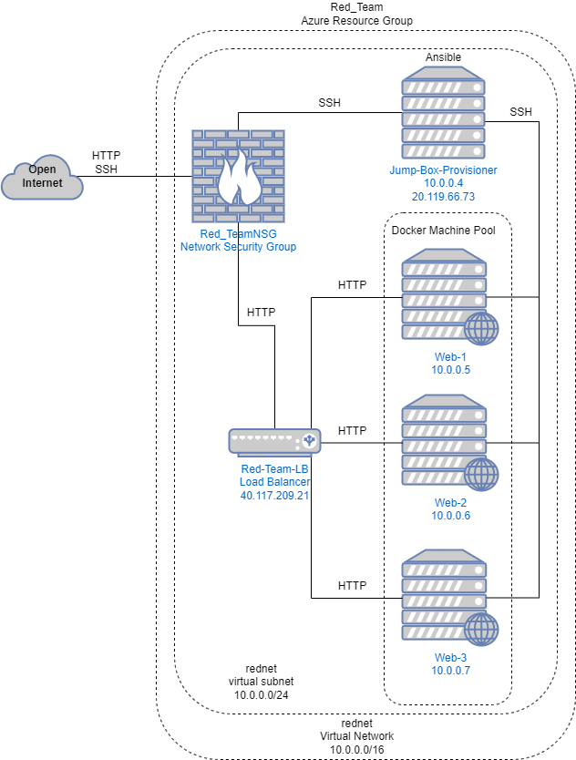
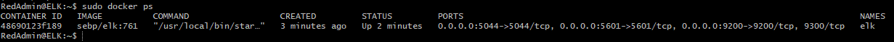

## Automated ELK Stack Deployment

The files in this repository were used to configure the network depicted below.

These files have been tested and used to generate a live ELK deployment on Azure. They can be used to either recreate the entire deployment pictured above. Alternatively, select portions of the yaml files may be used to install only certain pieces of it, such as Filebeat.

  - 
  - 
  - 
  - 
  - 

This document contains the following details:
- Description of the Topology
- Access Policies
- ELK Configuration
  - Beats in Use
  - Machines Being Monitored
- How to Use the Ansible Build

### Description of the Topology

The main purpose of this network is to expose a load-balanced and monitored instance of DVWA, the D*mn Vulnerable Web Application.

Load balancing ensures that the application will be highly available, in addition to restricting access to the network. A jump box for deployment and configuration is used to protect the production servers in the event of an attack or compromise for ease of redeployment.

Integrating an ELK server allows users to easily monitor the vulnerable VMs for changes to the file structure and/or system resources.

The configuration details of each machine may be found below.

| Name                 | Function | IP Address | Operating System |
|----------------------|----------|------------|------------------|
| Jump-Box-Provisioner | Gateway  | 10.0.0.1   | Linux            |
| Web-1                | DVWA     | 10.0.0.5   | Linux            |
| Web-2                | DVWA     | 10.0.0.6   | Linux            |
| Web-3                | DVWA     | 10.0.0.7   | Linux            |
| ELK                  | ELK      | 10.1.0.4   | Linux            |

### Access Policies

The machines on the internal network are not exposed to the public Internet. 

Only the Jump_Box_Provisioner machine can accept connections from the Internet. Access to this machine is only allowed from the following IP addresses: 24.163.61.212/32,82.23.192.159/32,68.96.89.78/32

Machines within the network can only be accessed by Jump_Box_Provisioner on 10.0.0.4.

A summary of the access policies in place can be found in the table below.

| Name     | Publicly Accessible | Allowed IP Addresses       |
|----------|---------------------|----------------------------|
| Jump Box | Yes                 | 10.0.0.0/16 10.1.0.0/16    |
| Web-1    | No                  | 10.0.0.0/16 10.1.0.0/16    |
| Web-2    | No                  | 10.0.0.0/16 10.1.0.0/16    |
| Web-3    | No                  | 10.0.0.0/16 10.1.0.0/16    |
| ELK      | No                  | 10.0.0.0/16 10.1.0.0/16    |

### Elk Configuration

Ansible was used to automate configuration of the ELK machine. No configuration was performed manually, which is advantageous because redeployment of machines is automated and simplified if the need arises.

The playbook implements the following tasks:
- Install Docker
- Install Python3
- Increase & Use Virtual Memory
- Start ELK Docker Container

The following screenshot displays the result of running `docker ps` after successfully configuring the ELK instance.

### Target Machines & Beats
This ELK server is configured to monitor the following machines:
- 10.0.0.5
- 10.0.0.6
- 10.0.0.7

We have installed the following Beats on these machines:
- Filebeat
- Metricbeat

These Beats allow us to collect the following information from each machine:
- Filebeat collects log data and reports changes such as web traffic or error logs.
- Metricbeat collects system statistics such as disk space and memory utilization.

### Using the Playbook
In order to use the playbook, you will need to have an Ansible control node already configured. Assuming you have such a control node provisioned: 

SSH into the control node and follow the steps below:
- Copy the playbook file to ansible.
- Update the hosts file to include IP addresses for the new machines under the correct headers; webservers and elk.
- Run the playbook, and navigate to [Kibana](http://40.78.134.75:5601/app/kibana) to check that the installation worked as expected.